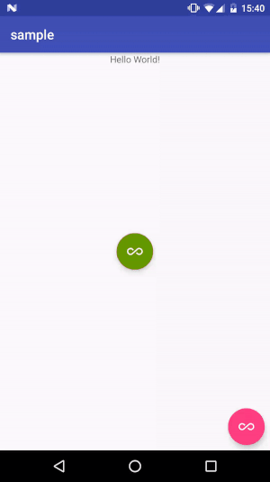

# FAB.ulous
FAB.ulous is a lightweight library that help build FAB menu from a menu XML and customize the the pattern you want!



## Install
Add it in your root build.gradle at the end of repositories:

```groovy
	allprojects {
		repositories {
			...
			maven { url "https://jitpack.io" }
		}
	}
```
Then add the dependency to the application module:

```groovy
	dependencies {
		compile 'com.github.fueled:fabulous:X.X.X'
	}
```

## Getting Started
To setup a FAB.ulous menu you need at least 3 things:

- A FloatingActionButton Widget that will be the base for the menu.
- A menu XML to build the menu from.
- A FabulousPattern that will position the menu items on the screen.

```java
new Fabulous.Builder(this)
    	.setFab(binding.exampleOne)
    	.setFabOverlay(binding.overlay)
    	.setMenuId(R.menu.menu_sample)
    	.setMenuPattern(new LinearPattern())
    	.build();

```

Now you can capture click in `onOptionsItemSelected`:

```java
@Override
public boolean onOptionsItemSelected(MenuItem item) {
    Snackbar.make(binding.getRoot(), item.getTitle(), Snackbar.LENGTH_SHORT).show();
    return super.onOptionsItemSelected(item);
}

```

### Create a menu pattern
Simply implement the `FabulousPattern`:

```java
public class LinearPattern implements FabulousPattern {
    private static final int MAIN_FAB_ANIMATION_DURATION = 200;

    @NotNull
    @Override
    public AnimatorSet getClosingAnimation(@NotNull View element, float destX, float destY) {
        AnimatorSet anim = new AnimatorSet();
        ObjectAnimator fabX = ObjectAnimator.ofFloat(element, View.X, destX);
        fabX.setDuration(MAIN_FAB_ANIMATION_DURATION);
        ObjectAnimator fabY = ObjectAnimator.ofFloat(element, View.Y, destY);
        fabY.setDuration(MAIN_FAB_ANIMATION_DURATION);

        anim.play(fabX).with(fabY);
        return anim;
    }

    @NotNull
    @Override
    public AnimatorSet getOpeningAnimation(@NotNull View element, float destX, float destY) {
        AnimatorSet anim = new AnimatorSet();
        ObjectAnimator fabX = ObjectAnimator.ofFloat(element, View.X, destX);
        fabX.setDuration(MAIN_FAB_ANIMATION_DURATION);
        ObjectAnimator fabY = ObjectAnimator.ofFloat(element, View.Y, destY);
        fabY.setDuration(MAIN_FAB_ANIMATION_DURATION);

        anim.play(fabX).with(fabY);
        return anim;
    }

    @NotNull
    @Override
    public FabulousPosition getFinalPosition(@NotNull View subMenu, float fabX, float fabY, int position, int menuSize) {
        return new FabulousPosition(fabX, fabY - ((position + 1) * 200));
    }
}

``` 

- `getFinalPosition` Contains the algorithm that will compute each menu item final position on the screen.
- `getOpeningAnimation` Contains the animation to play when the menu opens.
- `getClosingAnimation` Contains the animation to play when the menu closes.


### Extra Features

#### Add Overlay
Adding an overlay when the menu opens is very simple; add the view to your layout and let FAB.ulous know about it using `setFabOverlay`.

```java
new Fabulous.Builder(this)
	.setFab(binding.exampleOne)
	.setFabOverlay(binding.overlay)
	.setMenuId(R.menu.menu_sample)
	.setMenuPattern(new LinearPattern())
	.build();
```

#### Add a transition on the main FAB
You might need to add some extra animation/transition on the main FAB when you open/close the menu.
Simple create a class that implements `FabulousTransition` and then pass an instance of that class using `setFabTransition`

```java
public class NinetyDegRotationTransition implements FabulousTransition {
    private static final int MAIN_FAB_ANIMATION_DURATION = 200;

    @NotNull
    @Override
    public AnimatorSet getClosingAnimation(@NotNull View element, float destX, float destY) {
        AnimatorSet anim = new AnimatorSet();
        ObjectAnimator fabX = ObjectAnimator.ofFloat(element, View.ROTATION, 0);
        fabX.setDuration(MAIN_FAB_ANIMATION_DURATION);
        anim.play(fabX);
        return anim;
    }

    @NotNull
    @Override
    public AnimatorSet getOpeningAnimation(@NotNull View element, float destX, float destY) {
        AnimatorSet anim = new AnimatorSet();
        ObjectAnimator fabX = ObjectAnimator.ofFloat(element, View.ROTATION, 90);
        fabX.setDuration(MAIN_FAB_ANIMATION_DURATION);
        anim.play(fabX);
        return anim;
    }
}
```

```java
new Fabulous.Builder(this)
	.setFab(binding.exampleTwo)
	.setMenuId(R.menu.menu_sample)
	.setMenuPattern(new CirclePattern())
	.setFabTransition(new NinetyDegRotationTransition())
	.build();
```

#### Add an extra listener when you click on the main FAB
If you need to an extra OnClickListener, for example,  in order to track the event, simple pass a `View.OnclickListener` to `setFABOnClickListener`.

```java
new Fabulous.Builder(this)
	.setFab(binding.exampleTwo)
	.setMenuId(R.menu.menu_sample)
	.setMenuPattern(new CirclePattern())
	.setFabTransition(new NinetyDegRotationTransition())
	.setFABOnClickListener(new View.OnClickListener() {
		@Override
		public void onClick(View v) {
			Analytics.trackEvent("menu_clicked");
		}
    })
    .build();

```


## License

    Copyright 2016 Fueled

    Licensed under the Apache License, Version 2.0 (the "License");
    you may not use this file except in compliance with the License.
    You may obtain a copy of the License at

       http://www.apache.org/licenses/LICENSE-2.0

    Unless required by applicable law or agreed to in writing, software
    distributed under the License is distributed on an "AS IS" BASIS,
    WITHOUT WARRANTIES OR CONDITIONS OF ANY KIND, either express or implied.
    See the License for the specific language governing permissions and
    limitations under the License.